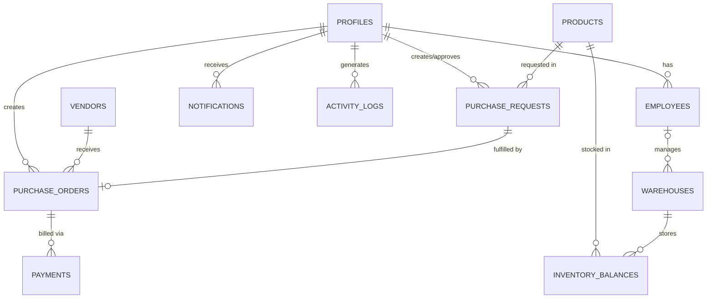

# Database Schema Documentation

Inventix utilizes a robust PostgreSQL database orchestrated via Supabase. All tables are strictly protected using Row-Level Security (RLS) policies.

## Entity-Relationship Diagram

## Core Tables

### 1. `profiles`
The central user identity table, linked 1-to-1 with Supabase `auth.users` via triggers.
- **id** (UUID, PK): References `auth.users(id)`.
- **email** (Text): User's email address.
- **full_name** (Text): Display name.
- **role** (Text): Application role (`viewer`, `sourcing_admin`, `manager`, etc).
- **organization** (Text): Tenant identifier.

### 2. `companies`
Primary organizational entities. Supports multi-subsidiary layouts.
- **id** (UUID, PK): Auto-generated.
- **name** (Text): Company name.
- **tax_identifier** (Text): Unique tax ID.
- **reporting_currency** (Text): Default currency (e.g., USD).

### 3. `employees`
Corporate personnel directory with departmental assignment and reporting hierarchy.
- **id** (UUID, PK): Auto-generated.
- **user_id** (UUID, FK): References `profiles(id)`.
- **manager_id** (UUID, FK): Self-referencing link to supervisor.
- **department** (Text): Sourcing, Logistics, Finance, etc.

### 4. `vendors`
Approved supplier registry with quality and delivery performance metrics.
- **id** (UUID, PK): Auto-generated.
- **code** (Text): Unique vendor identifier.
- **payment_terms** (Text): e.g., Net 30.
- **quality_rating_pct** (Numeric): Supplier quality score (0-100).
- **on_time_delivery_pct** (Numeric): Delivery reliability score (0-100).

### 5. `products`
Material master catalog.
- **id** (Text, PK): Business identifier (e.g., PRD-001).
- **sku** (Text): Unique Stock Keeping Unit.
- **unit_price** (Numeric): Base price.
- **lead_time_days** (Integer): Days to procure.
- **stock_status** (Text): 'In Stock', 'Low Stock', 'Out of Stock'.

### 6. `warehouses`
Physical fulfilment centres with volumetric capacity.
- **id** (UUID, PK): Auto-generated.
- **code** (Text): Unique location code.
- **max_cubic_capacity** (Numeric): Storage limit.
- **manager_id** (UUID, FK): References `employees(id)`.

### 7. `inventory_balances`
Live quantity ledger. Junction table between Products and Warehouses.
- **id** (UUID, PK): Auto-generated.
- **product_id** (Text, FK): References `products(id)`.
- **warehouse_id** (UUID, FK): References `warehouses(id)`.
- **on_hand_qty** (Integer): Physical stock count.
- **allocated_qty** (Integer): Reserved stock count.
- **safety_stock_qty** (Integer): Minimum threshold count.

### 8. `purchase_requests`
Internal procurement drafts requiring approval.
- **id** (Text, PK): Request ID.
- **product_id** (Text, FK): References `products(id)`.
- **quantity** (Integer): Items requested.
- **requestor_id** (UUID, FK): References `profiles(id)`.
- **status** (Text): 'Pending', 'Approved', 'Rejected'.

### 9. `purchase_orders`
Formal vendor contracts converted from approved Purchase Requests.
- **id** (UUID, PK): Auto-generated.
- **po_number** (Text): Human readable PO code.
- **vendor_id** (UUID, FK): References `vendors(id)`.
- **status** (Text): 'Draft', 'Sent', 'Received', 'Completed', etc.

### 10. `payments`
Accounts payable transactions linked to POs.
- **id** (UUID, PK): Auto-generated.
- **invoice_number** (Text): Unique bill code.
- **purchase_order_id** (UUID, FK): References `purchase_orders(id)`.
- **amount_paid** (Numeric): Value settled.
- **status** (Text): 'Unpaid', 'Paid', 'Overdue', etc.

### 11. `notifications`
System alerts for users.
- **id** (UUID, PK): Auto-generated.
- **title / description** (Text): Alert content.
- **user_id** (UUID, FK): Recipient (NULL for broadcast).

### 12. `activity_logs`
Immutable audit feed for system actions.
- **id** (BigInt, PK): Auto-incrementing identity.
- **action / details** (Text): Event description.
- **type** (Text): 'success', 'warning', 'info'.

### 13. `ai_recommendations`
AI engine output for predicting stockouts or sourcing optimizations.
- **id** (UUID, PK): Auto-generated.
- **item** (Text): Context.
- **severity** (Text): 'low', 'medium', 'high'.
- **suggested_qty** (Integer): Reorder suggestion.

### 14. `saved_reports`
Persisted report configurations.
- **id** (UUID, PK): Auto-generated.
- **query_config** (JSONB): Export filters.
- **file_url** (Text): Link to generated document.

### 15. `system_settings`
Global Key-Value application configurations.
- **key** (Text, PK)
- **value** (Text)
